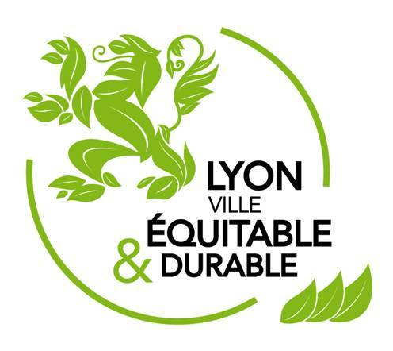
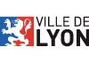

<iframe width="560" height="315" src="https://www.youtube.com/embed/iNkfXaI04ZA" frameborder="0" allow="autoplay; encrypted-media" allowfullscreen></iframe>

#  Appel à idées

**"Si vous aviez une baguette magique, que feriez-vous pour rendre votre quartier plus vert’ueux ?"**

Tous les enfants, adultes, associations, commerces ... peuvent répondre à ce sujet, par : 

* le biais du [formulaire](https://framaforms.org/appel-a-idees-vertueuses-1518976327)
* en envoyant un mail à contact-123durable@googlegroups.com 
* en se rendant dans un de nos commerces partenaires (liste à venir)

Vous pouvez trouver le règlement de cet appel à idées dans [ce pdf](documents/Reglement_Appel_Idee.pdf)

<iframe width="100%" height="300px" frameBorder="0" src="https://umap.openstreetmap.fr/fr/map/123durable-partenaire-appel-a-idee_212938?scaleControl=false&miniMap=false&scrollWheelZoom=false&zoomControl=true&allowEdit=false&moreControl=true&searchControl=null&tilelayersControl=null&embedControl=null&datalayersControl=true&onLoadPanel=undefined&captionBar=false"></iframe>
<a href="https://umap.openstreetmap.fr/fr/map/123durable-partenaire-appel-a-idee_212938">Voir en plein écran</a>

#  Un événement convivial et ludique le 2 juin 2018, à la Croix Rousse

Afin d'initier votre famille, vos amis, vos voisins au développement durable, nous vous proposons une journée de jeux et d'animations pour toutes et tous avec l'aide de nombreux partenaires spécialistes de la question !

**Cette journée aura lieu le samedi 2 juin 2018, place de la Croix Rousse 69004 Lyon (place à confirmer), de 10h à 18h !** 

A noter également la projection du film **FoodCoop** le vendredi 1er juin à 21h à la Maison des Associations, 28 Rue Denfert Rochereau, 69004 Lyon.

# Guide pour une Croix Rousse durable 

Enfin pour vous accompagner dans une transformation au quotidien, nous allons rédiger avec des habitants du quartier un guide qui mettra en valeur des gestes et des lieux contribuant au développement durable dans notre quartier. Il sera en libre distribution le 2 juin et vous pourrez aussi le retrouver en téléchargement sur ce site.

# Partenaires et labels

Cet événement qui s'inscrit dans le cadre de [la semaine du Développement Durable](http://evenements.developpement-durable.gouv.fr/campagnes/sedd2018/presentation-semaine-europeenne-du-developpement-durable) est soutenu par la ville de Lyon et la mairie du 4eme arrondissement. 
Il est également labellisé Lyon Ville Equitable et Durable.

